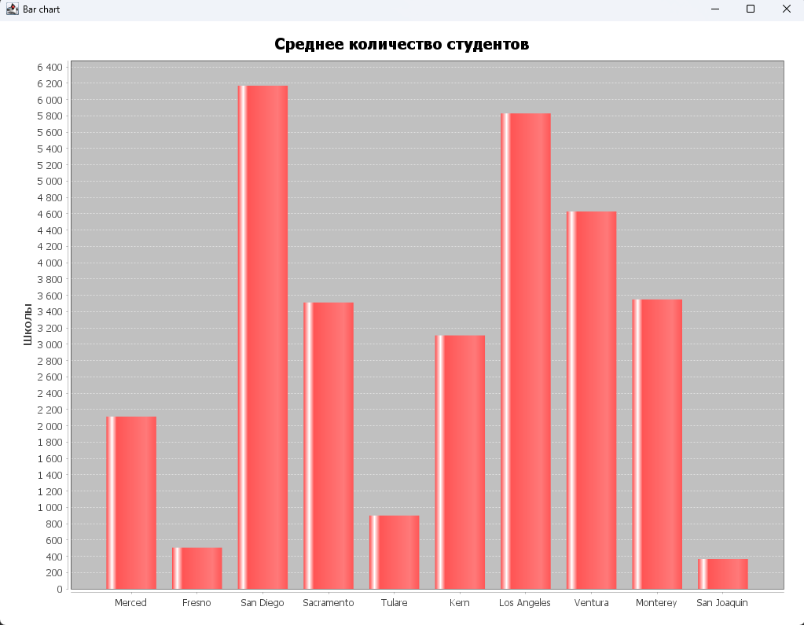
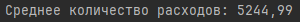
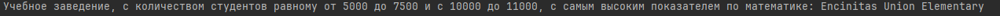

# Вариант 2. Школы.

## Задание 1
***Задача:*** *Постройте график по среднему количеству студентов, в 10 различных странах, взять на свой выбор.*

**График:**

## Задание 2
***Задача:*** *Выведите в консоль среднее количество расходов(expenditure) в Fresno, Contra Costa, El Dorado и Glenn, у которых расход больше 10.*

**Результат:**

## Задание 3
***Задача:*** *Выведите в консоль учебное заведение, с количеством студентов равному от 5000 до 7500 и с 10000 до 11000, с самым высоким показателем по математике (math)*

**Результат:**

